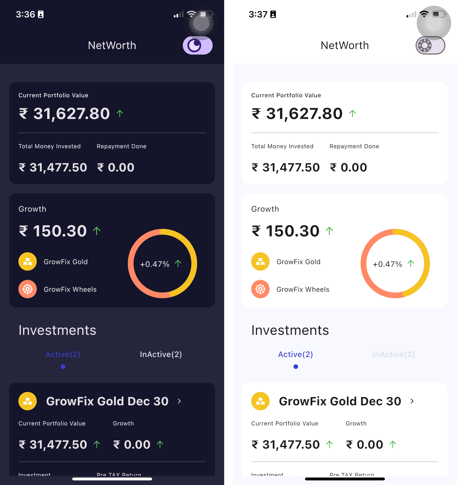
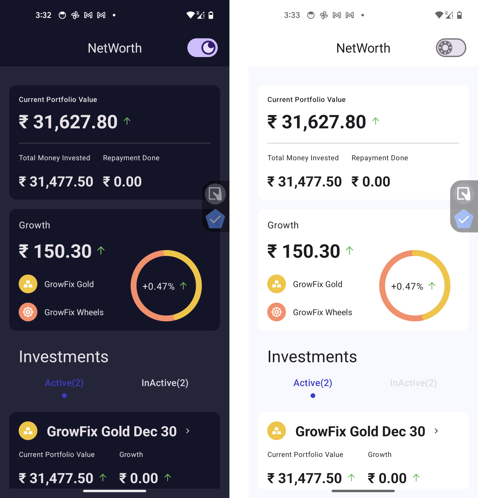

[](https://confluence.jetbrains.com/display/ALL/JetBrains+on+GitHub)
[](https://opensource.org/licenses/Apache-2.0)
[](https://github.com/jerryOkafor/NetWorth/actions/workflows/Build.yml)
[](https://codecov.io/gh/jerryOkafor/NetWorth)

# NetWorth, A [Compose Multiplatform](https://github.com/JetBrains/compose-multiplatform) mobile application

> **Note**
> Compose Multiplatform for iOS is in Alpha. It may change incompatibly and require manual migration
> in the future.
> We would appreciate your feedback on it in the public Slack
> channel [#compose-ios](https://kotlinlang.slack.com/archives/C0346LWVBJ4/p1678888063176359).
> If you have any issues, please report them
> on [GitHub](https://github.com/JetBrains/compose-multiplatform/issues).

## Screenshots

### Android

<p align="center">
  
</p>

### iOS

<p align="center">
  
</p>

## Set up the environment

> **Warning**
> You need a Mac with macOS to write and run iOS-specific code on simulated or real devices.
> This is an Apple requirement.

To work with this template, you need the following:

* A machine running a recent version of macOS
* [Xcode](https://apps.apple.com/us/app/xcode/id497799835)
* [Android Studio](https://developer.android.com/studio)
*

The [Kotlin Multiplatform Mobile plugin](https://plugins.jetbrains.com/plugin/14936-kotlin-multiplatform-mobile)

* The [CocoaPods dependency manager](https://kotlinlang.org/docs/native-cocoapods.html)

### Check your environment

Before you start, use the [KDoctor](https://github.com/Kotlin/kdoctor) tool to ensure that your
development environment is configured correctly:

1. Install KDoctor with [Homebrew](https://brew.sh/):

    ```text
    brew install kdoctor
    ```

2. Run KDoctor in your terminal:

    ```text
    kdoctor
    ```

   If everything is set up correctly, you'll see valid output:

   ```text
   Environment diagnose (to see all details, use -v option):
   [✓] Operation System
   [✓] Java
   [✓] Android Studio
   [✓] Xcode
   [✓] Cocoapods
   
   Conclusion:
     ✓ Your system is ready for Kotlin Multiplatform Mobile development!
   ```

Otherwise, KDoctor will highlight which parts of your setup still need to be configured and will
suggest a way to fix them.

## Examine the project structure

Open the project in Android Studio and switch the view from **Android** to **Project** to see all
the files and targets belonging to the project:


Your Compose Multiplatform project includes 4 modules:

### shared

This is a Kotlin module that contains the logic common for both Android and iOS applications, that
is, the code we share between platforms.

It uses Gradle as the build system. You can add dependencies and change settings
in `shared/build.gradle.kts`.
The `shared` module builds into an Android library and an iOS framework.

### sharedUI

This is a Kotlin module that contains the UI logic common for both Android and iOS applications,
that is, the UI code we share between platforms.

This `sharedUI` module is also where you’ll write your Compose Multiplatform code.
In `sharedUI/src/commonMain/kotlin/App.kt`, you can find the shared root `@Composable` function for
your app.

It uses Gradle as the build system. You can add dependencies and change settings
in `sharedUI/build.gradle.kts`.
The `sharedUI` module builds into an Android library and an iOS framework.

### androidApp

This is a Kotlin module that builds into an Android application. It uses Gradle as the build system.
The `androidApp` module depends on and uses the `shared` and `sharedUI` module as a regular Android
library.

### iosApp

This is an Xcode project that builds into an iOS application.
It depends on and uses the `shared` and `sahredUI` module as a CocoaPods dependency.

## Run your application

### On Android

To run your application on an Android emulator:

1. Ensure you have an Android virtual device available.
   Otherwise, [create one](https://developer.android.com/studio/run/managing-avds#createavd).
2. In the list of run configurations, select `androidApp`.
3. Choose your virtual device and click **Run**:

   

   

<details>
  <summary>Alternatively, use Gradle</summary>

To install an Android application on a real Android device or an emulator,
run `./gradlew installDebug` in the terminal.

</details>

### On iOS

#### Running on a simulator

To run your application on an iOS simulator in Android Studio, modify the `iosApp` run
configuration:

1. In the list of run configurations, select **Edit Configurations**:

   

2. Navigate to **iOS Application** | **iosApp**.
3. In the **Execution target** list, select your target device. Click **OK**:

   

4. The `iosApp` run configuration is now available. Click **Run** next to your virtual device

#### Running on a real device

You can run your Compose Multiplatform application on a real iOS device for free.
To do so, you'll need the following:

* The `TEAM_ID` associated with your [Apple ID](https://support.apple.com/en-us/HT204316)
* The iOS device registered in Xcode

> **Note**
> Before you continue, we suggest creating a simple "Hello, world!" project in Xcode to ensure you
> can successfully run apps on your device.
> You can follow the instructions below or watch
> this [Stanford CS193P lecture recording](https://youtu.be/bqu6BquVi2M?start=716&end=1399).

<details>
<summary>How to create and run a simple project in Xcode</summary>

1. On the Xcode welcome screen, select **Create a new project in Xcode**.
2. On the **iOS** tab, choose the **App** template. Click **Next**.
3. Specify the product name and keep other settings default. Click **Next**.
4. Select where to store the project on your computer and click **Create**. You'll see an app that
   displays "Hello, world!" on the device screen.
5. At the top of your Xcode screen, click on the device name near the **Run** button.
6. Plug your device into the computer. You'll see this device in the list of run options.
7. Choose your device and click **Run**.

</details>

##### Finding your Team ID

In the terminal, run `kdoctor --team-ids` to find your Team ID.
KDoctor will list all Team IDs currently configured on your system, for example:

```text
3ABC246XYZ (Max Sample)
ZABCW6SXYZ (SampleTech Inc.)
```

<details>
<summary>Alternative way to find your Team ID</summary>

If KDoctor doesn't work for you, try this alternative method:

1. In Android Studio, run the `iosApp` configuration with the selected real device. The build should
   fail.
2. Go to Xcode and select **Open a project or file**.
3. Navigate to the `iosApp/iosApp.xcworkspace` file of your project.
4. In the left-hand menu, select `iosApp`.
5. Navigate to **Signing & Capabilities**.
6. In the **Team** list, select your team.

If you haven't set up your team yet, use the **Add account** option and follow the steps.

</details>

To run the application, set the `TEAM_ID`:

1. In the template, navigate to the `iosApp/Configuration/Config.xcconfig` file.
2. Set your `TEAM_ID`.
3. Re-open the project in Android Studio. It should show the registered iOS device in the `iosApp`
   run configuration.

## How to configure the iOS application

To get a better understanding of this template's setup and learn how to configure the basic
properties of your iOS app without Xcode,
open the `iosApp/Configuration/Config.xcconfig` file in Android Studio. The configuration file
contains:

* `APP_NAME`, a target executable and an application bundle name.
* `BUNDLE_ID`,
  which [uniquely identifies the app throughout the system](https://developer.apple.com/documentation/bundleresources/information_property_list/cfbundleidentifier#discussion).
* `TEAM_ID`, [a unique identifier generated by Apple that's assigned to your team](https://developer.apple.com/help/account/manage-your-team/locate-your-team-id/#:~:text=A%20Team%20ID%20is%20a,developer%20in%20App%20Store%20Connect).

To configure the `APP_NAME` option, open `Config.xcconfig` in any text editor *before opening* the
project in Android Studio, and then set the desired name.

If you need to change this option after you open the project in Android Studio, do the following:

1. Close the project in Android Studio.
2. Run `./cleanup.sh` in your terminal.
3. Change the setting.
4. Open the project in Android Studio again.

To configure advanced settings, use Xcode. After opening the project in Android Studio,
open the `iosApp/iosApp.xcworkspace` file in Xcode and make changes there.

### Run to encrypt `Config.xcconfig` and commit to git

```bash
gpg --symmetric --cipher-algo AES256 iosApp/Configuration/Config.xcconfig
```

# References

[Awesome Kotlin Multiplatform](https://github.com/terrakok/kmp-awesome)
[Testing KMP App](https://kotlinlang.org/docs/multiplatform-run-tests.html)
[How to build Gradle projects with GitHub Actions](https://gradlehero.com/build-gradle-projects-with-github-actions/)
[A Better Way to Use Gradle With Github Actions](https://blog.gradle.org/gh-actions)
[Executing Gradle builds on GitHub Actions](https://docs.gradle.org/current/userguide/github-actions.html)